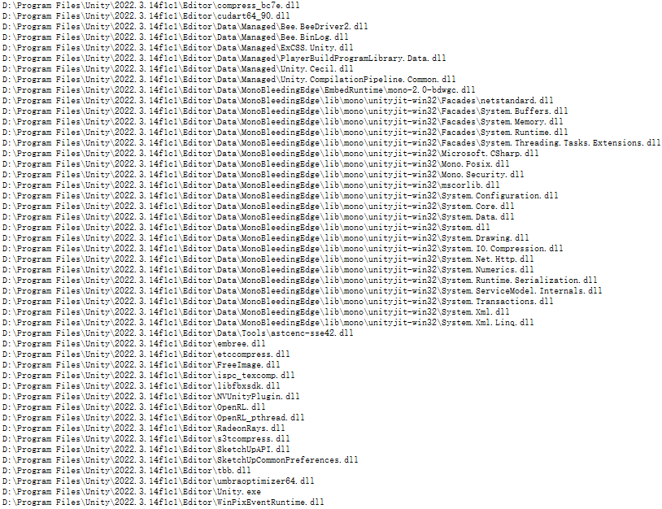

# Unity Injection V2 (持续更新中)

计划声明：此库文档先行，暂时不上传实现，用于分享背后原理和征集意见。

转载声明：此文档包含博客性质内容，创作不易，转请注。

叠甲声明：本人尚处于学习阶段，内容设计面较广，如有纰漏还请大神读者指出。


## 版本计划

此仓库将逐渐取代原Unity Injection，原本Unity Injection将在适时Archive

## 0. 系统设计考量

原本V1存在的问题：
* 使用调试工具调试Unity.exe，可以看到占用了一部分dll，对于其中的.net dll，在编辑器模式下是无法织入的。

* 编辑器模式织入效率低
* ~~程序集查找路径不可靠~~（v1可解决）

期望中的系统应满足以下要求：

* Unity全平台、全backend支持
* Editor下快速无感注入
* 接口简洁，方便功能开发
* 稳定可靠

基本工作过程：系统在代码中扫描InjectionInfo，并逐一Patch

## 1. 工作原理分析

### 1.1 Unity构建工作流
### 1.2 不同阶段的执行逻辑

初步方案是player使用织入，editor使用动态程序集+jit hook

下文的`clr`应包括包括广义上的mono clr、core clr、libil2cpp

## 2. Jit Hook类的解决方案

这里分析两位大神的仓库实现：

* https://github.com/bigbaldy1128/DotNetDetour
* https://github.com/Misaka-Mikoto-Tech/MonoHook

如果不了解原理，先结合 https://bbs.csdn.net/topics/391958344 或者 https://zhuanlan.zhihu.com/p/547772502 ，看DotNetDetour，再看MonoHook。主要区别是Misaka-Mikoto-Tech大神丰富了abi，增强了稳定性，适配了Unity环境。

两者都是典型的hook方案，原理不再赘述。

请确保能完全理解DetourHook，并熟读il2cpp源码后再继续阅读以下子章节。

### 2.0 引入的需求

此仓库希望Jit Hook库：
* 不需要用户定义一个相同的代理函数。如果编译时确定，可以借助Roslyn的SourceGenerate；否则，可以通过动态程序集
* 无参方式调用原函数。见[无参调用](#210-无参调用和tail-call)
* replace method传入Delegate而不是MethodBase。见[delegate-和-cx寄存器](#29-delegate-和-cx寄存器)

### 2.1 AX寄存器

DotNetDetour方案先压栈保留了原ax的值，而MonoHook直接修改ax。两位作者都没有进行更深入的解析，我只能按照自己的理解分析。

我们知道ax用于函数返回，如果原函数的“5字节”修改了ax，那么是需要保留ax的。对于Debug模式下生成的Jit指令，这显然是成立的，因为每个函数都有前缀的trap codes，远大于跳转指令长度；但是Release模式下，如果jit code过早的mov ax，或者call xxx，那么ax是处于修改状态的，需要保留。

### 2.2 多线程访问

DotNetDetour的作者bigbaldy1128大神在博客中提到过：
>到了这里，我们就知道了修改从push ebp开始的5个字节为jmp跳转指令，跳入我们自己的函数就可以达到hook的目的，但执行到我们的函数后，如果我们并不是要拦截执行流程，那么我们最终是需要再调用原函数的，但原函数已经被修改了，这会想到的办法就是恢复那修改的5字节指令，但这又会引发另一个问题，就是当我们恢复时，正好另一个线程调用到这个函数，那么程序将会崩溃，或者说漏掉一次函数调用，修改时暂停其他线程并等待正跑在其中的CPU执行完这5字节再去恢复指令也许是个不错的办法，但感觉并不容易实现，而且影响性能，所以我放弃了这种办法

事实上，如果不是每次都修改，只是“Install”的时候修改jit依然会有多线程race condition的问题。当我们在内存上memcpy时，如果恰好另一线程访问了此处代码，就会发生不可预料的结果。

想要彻底解决race condition:

* 获取当前进程下所有线程，将函数id转为Windows下的Handle，再调用Kernel32的SuspendThread方法；循环挂起，直到没有新的线程；“install”；恢复挂起的线程
* 修改内存Flag为CopyOnWrite，在memcpy结束后修改函数指针入口

### 2.3 代理函数注入方法

上述两个仓库的实现在这点上有所不同，DotNetDetour是修改函数入口，而MonoHook直接修改函数jit code。

值得注意的是，DotNetDetour的入口修改方法在Unity下是无效的：
```csharp
*((ulong*)((uint*)method.MethodHandle.Value.ToPointer() + 2)) = (ulong)ptr;
```
原库是在.Net Framework环境下工作的，但对于mono和core，需要其他的方法修改入口：
阅读[dotnet/runtime](https://github.com/dotnet/runtime)的源码可以发现，clr会在一个lut中保留MonoJitInfo，修改JitInfo中的字段方可改变函数入口。实现详见：https://github.com/bigbaldy1128/DotNetDetour/issues/21#issuecomment-2059344745

但是这种做法并不是完美的，见[2.4](#24-修改引用的写后屏障)和[2.5](#25-修改方法的导出问题)


### 2.4 修改引用的写后屏障（入口修改副作用）

为了使gc正常工作，我们在修改了内存中的引用后，需要调用一次gc_wbarrier，将白色垃圾置灰，此方法在gc库中实现。然而，考虑到运行时的gc库可能各不相同，如：低版本mono和il2cpp的BoehmGC、高版本clr的SGenGC、一些项目替换的其他gc实现等。

因此，确定一个可靠的写屏障方法变得困难。

### 2.5 修改方法的导出问题（入口修改副作用）

比如，修改方法用到了mono_jit_info_table_find，这个方法因为是export function，所以才可以调用；除此之外，还有icall指令可以用类似的方法访问。

Unity可以使用libMono中的export function，得益于UnityEditor只是将libMono作为动态库加载。但是对于纯c#环境，不能直接访问到此方法。

理论上讲，只要我们能够获得方法的地址，我们就可以调用对应clr内部方法。我们可以通过符号表、地址偏移等方法得到一个特定环境下的入口，但是此类方法难以普及，并且可能非常不稳定。

可见，修改函数入口有诸多问题，但是如果修改jit code buffer呢？
> 通过阅读[dotnet/runtime](https://github.com/dotnet/runtime)的源码可以发现，jit实现中，会将所有的jit放入块表中，每个块表大小相当，但不完全相同。free jit code时，先找到对应的块表，再通过code start和code size判断正确的内存区块，如果method已被置为tombstone，则可以安全释放。这就是jit code在内存中的基本组织形式。

### 2.6 icache一致性（函数体修改副作用）

对于cpu中的icache，在修改了jit code后，将面临缓冲失效的问题。如果此时系统没有立即替换缓冲区，则会导致程序依然执行旧的逻辑。

如你可能Install后，直接执行原方法，会发现并没有生效：
```csharp
HookTool.Install();
TargetMethod(); // not hooked
```

此问题在不同的cpu上会有不同的表现。在Install时可以使用extern调用`mfence`的方式保证icache有效性。


### 2.7 Jit code共享（函数体修改副作用）

对于相同的jit方法，共享一份jit code是可行的。

然而事实上，通过阅读源码发现`dotnet/runtime`没有对相同的jit code进行共享，因此修改特定方法的jit code不会有副作用。

但是不同的clr种类、未来的版本中，很难保证不会引入jit共享的特性。

### 2.8 Inline Method
对于如下代码：
```csharp
// [MethodImpl(MethodImplOptions.NoInlining)]
void Foo(){
    Console.WriteLine("Foo");
}

void Bar(){
    Foo(); // not hooked
}
```
如果我们hook了`Foo`，那么执行`Bar`之后，你可能并不会看到hook后的效果，这是因为，Foo的jit代码已经内嵌到了Bar的jit中，我们再修改Foo的jit已经于事无补。

我们增加`MethodImplOptions.NoInlining`后，再次执行`Bar`，可以看到hook后的结果。

```csharp
[MethodImpl(MethodImplOptions.NoInlining)]
void Foo(){
    Console.WriteLine("Foo");
}

void Bar(){
    Foo(); // it works
}
```

然而对于一个目标方法，在运行时无法给定`MethodImplOptions.NoInlining`，时机往往太迟了。

### 2.9 Delegate 和 CX寄存器

为使用灵活性考虑，本仓库希望传入的replace method不是MethodBase，而是Delegate类型。有什么区别呢？

Delegate比MethodBase包含了更多的信息，如：this caller。此Delegate可能来自lambada。

以x86和x64为例，含this的代理和成员方法会先压入一个this指针或修改CX为this指针，其他写入dx或继续压入SP。

因此使用原本的函数签名调用一个含this的代理时，压入的参数缺了一个（对于lambda则是编译器生成的`Display_Class`上下文类）。

想要修复这个问题，我们首先要明确目标函数的调用规约，如传参顺序、位置、清栈者等。

如，对于x86 fastcall，需要大致如下的汇编指令：
```asm
push [rsp+param_offset]
push edx
mov [rsp+param_offset],edx
mov edx,ecx
mov ecx,inst_addr
add rsp,4

jump code...

sub rsp,4
pop edx
pop [rsp+param_offset]
```

同时兼顾不同的调用规约、指令集，是一件比较麻烦的事情。

### 2.10 无参调用和tail-call

为使用灵活性考虑，本仓库希望同时产出一个无参回调代理函数。

比较容易想到的做法是修改ret n指令为ret，即不对原堆栈进行修改。但是此做法的前提是callee清栈，对于caller清栈则无能为力。而且对于拷贝后的相对地址jmp指令也会失效。

因此，可以使用拷贝堆栈的方式，类似2.9中的方法，并且把ret指令替换为ret n指令。但这样的实现会增加一些调用负载。

## 3. 各类CLR在“方法注入”相关部分的源码解读及分析

### 3.0 CLR Jit内部实现，对比JsCore、Mono、LLVM
### 3.1 Mono 和 IL2CPP Delegate内部的实现
### 3.2 Mono 和 IL2CPP Expression内部的实现
### 3.3 Mono 泛型共享
### 3.4 IL2CPP 泛型共享和完全泛型共享
### 3.5 Mono方法调用的内部实现
### 3.6 IL2CPP方法调用的内部实现
### 3.7 Mono动态程序集
### 3.8 UnityEditor下“动态逆向”的实现方法


## 4. 最终草案

editor下优先织入，织入失败再尝试hook

player下只织入